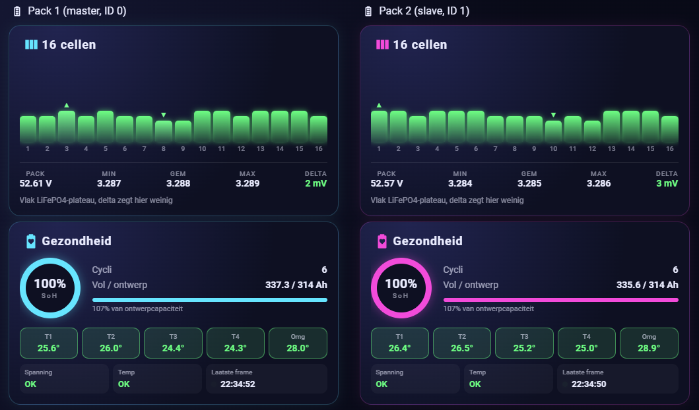
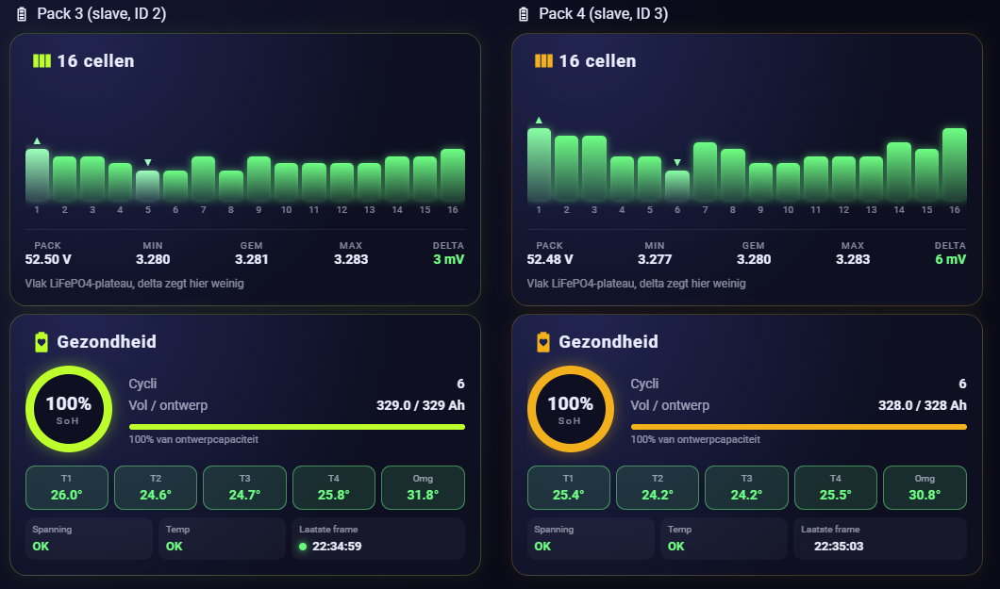

# Reverse-engineering the Docan DR-WIFI-04-V2 battery Wi-Fi stick for ESPHome

**Status:** working prototype, documented 27 September 2026, status words and BMS parameters added 10 October 2026  
**Board tested:** `DR-WIFI-04-V2`, PCB date `2024-05-06`  
**Module:** Espressif ESP32-WROOM-32E  
**Battery tested:** Docan/DoCan ZZ 16-cell LiFePO4 packs (BMS firmware `STD05`, `LN10` and `ANZ09`) using the ASCII BMS protocol described below

## Home Assistant result

The decoded BMS data is published as native ESPHome entities. This dashboard combines four battery packs, each with its own stick running the same YAML, and shows stored energy, state of charge, individual cell voltages, cell delta, temperatures, capacity and state of health.


Each pack has its own cell and health cards. Packs 1 and 2 use the older BMS generation, packs 3 and 4 the newer `ANZ09` generation.





### Historical monitoring

Because the values are normal Home Assistant entities, they can be recorded and compared over time. This makes it possible to monitor pack synchronization, cell-voltage drift, temperature differences and balancing behaviour. The temperature graph shows the environment temperature of the `ANZ09` packs rising while their cell delta is high, which is described under [Environment temperature as a balancing indicator](#environment-temperature-as-a-balancing-indicator).


<details>
<summary>ESPHome and BMS diagnostics</summary>

The diagnostic entities expose BMS identity, valid-frame counters, raw status words and the automatically discovered BMS address and pack number. Serial numbers are redacted in this screenshot.


</details>


## Summary

I replaced the original firmware on a Docan battery Wi-Fi stick with ESPHome. The stick now reads the BMS locally, publishes the values directly to Home Assistant, discovers the connected BMS address automatically, and uses its three onboard LEDs for useful local status.

The configuration currently provides:

- pack voltage, current, power, state of charge and state of health;
- remaining and full-charge capacity, cycle count and internal resistance;
- all 16 cell voltages plus minimum, maximum, average and delta;
- environment, pack, MOS and four cell temperatures;
- operating state: charging, discharging or idle;
- decoded BMS protections and warnings, the cells being balanced and a "Balancer active" indicator, plus the raw status words;
- the BMS basic parameters (protection and alarm limits, balancer settings, charge voltage and current), read with service `80`;
- guarded writing of the two balancer settings only (service `81`, see [Service 81](#service-81-write-one-basic-parameter));
- design capacity and lifetime charge/discharge counters;
- BMS hardware, firmware and model, plus serial-number fields, production date and manufacturer code;
- valid/invalid frame counters and BMS communication state;
- automatic BMS-address discovery and recovery after a communication timeout;
- three automatic status LEDs.

The recommended setup is the shared ESPHome package [`common/docan-bms.yaml`](common/docan-bms.yaml) with one small device file per pack; see [Recommended setup: shared package](#recommended-setup-shared-package). The older single-file [generic ESPHome YAML](docan-wifi-stick-esphome.yaml) is kept for reference; it is read-only and does not yet contain the status-bit decoding or services `80`/`81`. Neither requires a custom ESPHome component.

This is an independent reverse-engineering result, not official Docan documentation. Confirm the PCB revision and pinout before using it on another stick.

## Why this was needed

The stick already contains a capable ESP32, but its original application is cloud-oriented. The goal was to reuse the existing hardware for fully local monitoring in Home Assistant and to avoid adding a second microcontroller or an external UART adapter permanently.

The work had two parts:

1. determine the electrical connections of the ESP32, BMS UART, programming pads and LEDs;
2. capture and decode enough of the BMS protocol to build a robust ESPHome configuration.

## Board identification and orientation

The rear silkscreen identifies the tested board as:

- `DR-WIFI-04-V2`
- `2024-05-06`

For all LED descriptions below, the board is oriented with the **ESP32 module on the left** and the **USB-A plug on the right**. The LEDs then form a vertical row:

1. LED1 at the top;
2. LED2 in the middle;
3. LED3 at the bottom.

This ordering matches the PCB silkscreen.

### Board photographs


*Front of the opened stick: ESP32-WROOM-32E and labelled test pads.*


*Second front overview showing the component layout and USB-A plug.*


*Rear of the PCB with the `DR-WIFI-04-V2` marking, board date and visible traces.*


*Temporary bench setup with a soldered 10 kΩ resistor and test leads. I used 10 kΩ because I did not have the initially suggested 20 kΩ resistor; 10 kΩ worked for the test. After cleaning the pads, the stick worked again without the resistor. This is a troubleshooting photograph, not a required permanent modification.*

## Confirmed ESP32 connections

The most important result is that the programming UART and the BMS UART are separate.

| Function | ESP32 GPIO | Status |
|---|---:|---|
| BMS UART TX | GPIO4 | Confirmed and working |
| BMS UART RX | GPIO17 | Confirmed and working |
| Programming/debug UART TX (`U0TXD`) | GPIO1 | Confirmed at the board TX pad |
| Programming/debug UART RX (`U0RXD`) | GPIO3 | Confirmed at the board RX pad |
| LED1 cathode via R9 | GPIO25 | Confirmed and working |
| LED2 cathode via R10 | GPIO26 | Confirmed and working |
| LED3 cathode via R12 | GPIO27 | Confirmed and working |

The BMS connection works at **9600 baud, 8 data bits, no parity, 1 stop bit (8N1)**.

The ESP32-WROOM-32E datasheet maps module pins 10, 11 and 12 to GPIO25, GPIO26 and GPIO27 respectively. That was important because early measurements mixed up physical module pin numbers and GPIO numbers.

## Programming pads

The board exposes pads labelled approximately as follows:

- `GND`, `KEY`, `GND`, `BOOT`, `EN`, `RX`, `TX`, `3V3` on one side;
- `GND`, `TDO`, `TCK`, `TDI`, `TMS`, `3V3` and related test pads on the other side.

The conventional ESP32 serial-flashing connections are therefore available:

| USB-to-UART adapter | Stick |
|---|---|
| TX | RX / GPIO3 |
| RX | TX / GPIO1 |
| GND | GND |
| 3.3 V logic | 3V3 only if the board is not powered elsewhere |

Pull `BOOT` low while resetting with `EN` to enter the ROM download mode. Use a **3.3 V UART**, not 5 V logic. Do not connect two power sources to the board at the same time; if the stick is powered separately, connect only UART TX, RX and common ground.

The USB-A form factor should not by itself be treated as proof that every signal on the board is standard USB data. The BMS serial link most likely uses the two middle pins of the USB-A plug, the positions of USB D− and D+, as TX and RX, at 3.3 V TTL level. Neither the pin assignment on the plug nor the signal level has been measured; only the ESP32 side (GPIO4/GPIO17) is confirmed. I only characterized the UART and power-related behavior needed for this project.

## How the LED pinout was found

The initial GPIO guesses did not control the LEDs. The successful process was:

1. With the stick powered, the USB-side terminal of all three LEDs measured 3.3 V.
2. Continuity testing showed that these three terminals share the board's 3.3 V rail.
3. In diode-test mode, placing the red probe on the USB side and the black probe on the other LED terminal illuminated each LED. The forward voltage was approximately 2.3–2.4 V.
4. The cathode traces were then followed through their series resistors to the ESP32 module pins.
5. Temporary ESPHome GPIO outputs confirmed the final mapping electrically and visually.

The final circuit is:

| LED | Series resistor | Resistor marking | ESP32 module pin | GPIO | Logic |
|---|---|---:|---:|---:|---|
| LED1, top | R9 | `472` (4.7 kΩ) | 10 | GPIO25 | Active-low |
| LED2, middle | R10 | `472` (4.7 kΩ) | 11 | GPIO26 | Active-low |
| LED3, bottom | R12 | `472` (4.7 kΩ) | 12 | GPIO27 | Active-low |

All three anodes are tied to 3.3 V. The ESP32 therefore sinks current: **GPIO low turns the LED on; GPIO high turns it off**. In ESPHome this is represented with `inverted: true`.

Earlier candidates such as GPIO32, GPIO33 and GPIO39 were ruled out. GPIO39 is input-only and cannot directly drive an LED. The apparent continuity readings that led to those candidates were high, rising resistance readings through other components rather than a direct copper connection.

## Final status-LED behavior

The test switches used during reverse engineering were removed from the final configuration. The LEDs are now internal outputs with automatic meanings:

| LED | Meaning | Behavior |
|---|---|---|
| LED1 / GPIO25 | ESPHome heartbeat | 120 ms flash every 2 seconds |
| LED2 / GPIO26 | Home Assistant connected | Solid while an API client subscribed to entity states is connected |
| LED3 / GPIO27 | Healthy BMS communication and activity | Solid while communication is healthy, with a 120 ms dark pulse for every valid BMS frame |

For LED2 the configuration uses ESPHome's `api.connected` condition with `state_subscription_only: true`. This deliberately ignores a logger-only client and makes the light a better approximation of an actual Home Assistant connection.

LED3 is switched off if no valid BMS frame has been received for more than 30 seconds. The timeout check runs every 10 seconds, so the visual change can occur up to almost 10 seconds after the 30-second threshold.

## GPIO1, GPIO3 and D1

GPIO1 and GPIO3 are not spare LED outputs. They are the ESP32's default UART0 pins:

- GPIO1 = `U0TXD` and is connected to the board's TX pad;
- GPIO3 = `U0RXD` and is connected to the board's RX pad.

UART0 is used by the ESP32 ROM for downloading firmware and by normal firmware for serial logging. The ESPHome configuration uses `logger: baud_rate: 0`, which disables runtime UART logging, but the pins should still be left alone because they remain important for flashing and may carry ROM boot messages during reset.

D1 is a three-terminal device connected to both GPIO1 and GPIO3. Diode-mode measurements with the red probe on its common terminal gave approximately 0.573 V and 0.700 V toward the two branches. Low-resistance checks associated those branches with GPIO1 and GPIO3.

What is **not yet proven** is where the common D1 terminal ultimately goes. Plausible roles include input protection/clamping or diode-OR activity coupling. It is not the primary LED1 driver: LED1 is conclusively controlled through R9 by GPIO25.

Two useful follow-up measurements would be:

- D1 common terminal to ground;
- D1 common terminal to the LED1 cathode.

## JTAG and other test pads

Two test-pad paths were followed physically:

| Test pad | Resistor | Confirmed GPIO |
|---|---|---:|
| TCK | R25, marked `1001` (1 kΩ) | GPIO13 |
| TDO | R26, marked `1001` (1 kΩ) | GPIO15 |

This matches the ESP32's default JTAG assignment:

| JTAG signal | Default ESP32 GPIO |
|---|---:|
| TDI / MTDI | GPIO12 |
| TCK / MTCK | GPIO13 |
| TMS / MTMS | GPIO14 |
| TDO / MTDO | GPIO15 |

Only the TCK and TDO resistor paths were explicitly continuity-confirmed on this board. TDI and TMS are consistent with the standard ESP32 mapping but still need direct board-level confirmation.

Measurements between the LED cathodes and these JTAG pads were in the megaohm range and rising. They are not the LED control paths.

## GPIO2, D4 and D38

D4 and D38 are nearby three-terminal parts. One shared terminal was found on the 3.3 V rail, and another node appears to be reached from GPIO2 through a resistor. However, measurements from LED2 and LED3 to these devices were in the megaohm range and rose while measuring. They are therefore not direct LED drivers.

Their exact purpose remains unresolved; they may be part of power, supervision or another support circuit. GPIO2 is also an ESP32 strapping pin, so the safe choice is to leave it unused until this circuit is understood.

## BMS serial protocol

The BMS uses printable ASCII hexadecimal frames in the DR-1363 format, which is similar to the Pylontech RS485 protocol. Every captured frame starts with `~` and ends with carriage return (`\r`):

```text
~  VER  ADR  CID1  CID2/RTN  LENGTH  INFO...  CHKSUM  \r
   22   xx   4A    xx        xxxx    ...      xxxx
```

| Full-frame character position | Size | Field | Meaning |
|---:|---:|---|---|
| 0 | 1 | `SOI` | Start marker `~` |
| 1 | 2 | `VER` | Protocol version, always observed as `22` |
| 3 | 2 | `ADR` | BMS address |
| 5 | 2 | `CID1` | Device type, always observed as `4A` |
| 7 | 2 | `CID2` / `RTN` | Command in requests, return code in responses |
| 9 | 4 | `LENGTH` | 4-bit `LCHKSUM` + 12-bit `LENID` |
| 13 | `LENID` | `INFO` | Payload as ASCII hex, two characters per byte |
| final 4 | 4 | `CHKSUM` | ASCII checksum |

`LENID`, the lower 12 bits of the length word, is the **number of ASCII payload characters**, not the number of decoded bytes. The count must therefore be even.

The high nibble, `LCHKSUM`, is `(-(sum of the three LENID hex digits)) & 0x0F`. Every captured request and response matches this rule, for example:

| `LENID` | `LENGTH` |
|---|---|
| `000` | `0000` |
| `002` | `E002` |
| `00A` | `600A` |
| `030` | `D030` |

The ESPHome configuration builds requests with a hard-coded, correct `LENGTH`. Its parser validates `LENID` and the frame checksum but does not yet check `LCHKSUM`.

In the four-pack setup, the addresses `00`–`03` matched the packs' address DIP-switch settings, with the master pack at `00`.

Responses carry the return code (`RTN`, `00` for success) at positions 7–8 instead of the command (`CID2`). A response therefore does not say which request it answers. The ESPHome configuration sends one request at a time, remembers the pending `CID2` (and, for `B0`, the data group) and interprets the next valid response accordingly.

### BMS generations observed

Four DoCan ZZ 16 kWh packs were monitored in parallel: two older and two newer units. Service `51` (see below) reports two BMS generations:

| | Older packs | Newer packs |
|---|---|---|
| BMS model | `16S200JC26` | `16S200JC35` |
| BMS firmware | `STD05`, `LN10` | `ANZ09` |
| BMS hardware | `T1` | `T1` |
| Service `42` live layout | leading `00` byte, then SOC | starts directly with SOC |

Raw status words also differ per firmware. For example, during normal operation the FET status word was `0x1023` on the `STD05` and `ANZ09` packs and `0x23` on the `LN10` pack. Compare raw status words only between packs running the same BMS firmware.

### Checksum

The checksum is the 16-bit two's complement of the sum of every ASCII byte after `~`, up to but not including the checksum itself:

```text
sum = ASCII(frame[1 ... character_before_checksum])
checksum = (-sum) & 0xFFFF
```

The checksum is appended as four uppercase hexadecimal characters.

### Confirmed requests

| CID2 | Purpose | Request or addressed command tail | Schedule used |
|---|---|---|---:|
| `50` | Discover BMS address | `~22004A500000FDA2\r` (broadcast, address `00`) | Every 5 s until discovered |
| `42` | Live telemetry | `42E00200` | Every 10 s |
| `51` | BMS hardware, firmware and model | `510000` | Once after every discovery, retried every 30 s until parsed |
| `B0` | Data group 03: serial numbers, production date, manufacturer | `B0600A000103FF00` | Once after every discovery, retried every 30 s until parsed |
| `B0` | Data group 04: lifetime counters | `B0600A000104FF00` | Every 60 s |
| `80` | Read basic parameters (212-byte block) | `80E002@@` (INFO = address) | After discovery, every hour and on a button (package only) |
| `81` | Write one basic parameter | `818008@@<index><value>` | Only on request, guarded (package only) |

Requests other than discovery are prefixed with `~22<address>4A` and followed by the checksum. In the package, `@@` in a command tail is replaced by the discovered BMS address, because services `80` and `81` carry the address in INFO as well. The `B0` INFO field has this layout:

```text
00 | operation (01 = read) | data group | FF | 00
```

Only operation `01` (read) has been used. Data groups 03 and 04 are confirmed; other groups have not been read yet.

Addressed frames are built at runtime. For example, with address `01` the live request is:

```text
~22014A42E00200FD29\r
```

One observed lifetime request and response at address `00` were:

```text
TX: ~22004AB0600A000104FF00FB6D\r
RX: ~22004A00D030B0000104FF12445783C07AA8000005440000048D02D80266F38E\r
```

### Identity responses

The service `51` payload contains three NUL-padded ASCII fields followed by bytes that are not yet understood:

| Payload offset | Field |
|---:|---|
| 0–9 | BMS hardware, e.g. `T1` |
| 10–19 | BMS firmware, e.g. `ANZ09` |
| 20–29 | BMS model, e.g. `16S200JC35` |
| 30 onward | 7 unknown bytes, logged only |

The `B0` data group 03 response is recognized by `payload[0] = B0`, `payload[2] = 01`, `payload[3] = 03` and `payload[4] = FF`. It was confirmed on a DoCan ZZ 16S pack:

| Payload offset | Field |
|---:|---|
| 0 | `B0` |
| 1 | `03` |
| 2 | Operation, `01` |
| 3 | Data group, `03` |
| 4 | `FF` |
| 5 | Data length, observed `0x71` (113) |
| 6–35 | Serial-number field 1, ASCII, NUL padded |
| 36–65 | Serial-number field 2, ASCII, NUL padded |
| 66–95 | Serial-number field 3, ASCII, NUL padded |
| 96–98 | Production date as binary `YY MM DD`, e.g. `1A 06 1A` = 2026-06-26 |
| 99 onward | Manufacturer code, ASCII, NUL padded |

The meaning of the three separate serial-number fields has not been established. They are published as three diagnostic text entities.

On all four packs, the first serial-number field had the form `AAAYYMMDDNNNN`: a three-letter prefix, a six-digit date and a four-digit number. The production date in bytes 96–98 was consistently two to five days after the date in that serial number. A plausible interpretation is that the serial number carries the cell or module date and the production date marks final pack assembly, but this has not been confirmed.

## Automatic BMS-address discovery

Hard-coding the address worked during early tests but was not robust because different packs answered at addresses such as `00`, `01` and `02`.

The final logic does this:

1. initialize the address to `0xFF`, meaning unknown;
2. broadcast `~22004A500000FDA2\r` every 5 seconds;
3. accept a checksummed zero-length success response;
4. learn the address from characters 3–4 of that response;
5. show the corresponding pack number as address + 1;
6. send subsequent telemetry requests to the discovered address;
7. forget the address and restart discovery after a BMS timeout.

Address `0x00` is valid, which is why `0xFF` is used as the unknown sentinel.

Only the zero-length discovery response is used to learn the address. This prevents an ordinary response-header value from accidentally changing it.

## Decoded live telemetry payload

All multi-byte values below are big-endian. `be16(i)` means a 16-bit unsigned value starting at decoded payload byte `i`; signed temperature and current fields use a signed 16-bit interpretation.

### Fixed beginning

Two layouts have been observed. Older BMS firmware (`STD05`, `LN10`) starts the payload with an extra `00` byte; newer firmware (`ANZ09`) starts directly with the state of charge. Let `b` be the start offset: `b = 1` for the older layout and `b = 0` for the newer one.

| Payload offset | Field | Scale |
|---:|---|---:|
| `b + 0` | State of charge | `be16 / 100` % |
| `b + 2` | Pack voltage | `be16 / 100` V |
| `b + 4` | Cell count `N` | 1–16 |
| `b + 5` onward | `N` cell voltages | each `be16 / 1000` V |

Let `p = b + 5 + 2N`, immediately after the cell voltages:

| Relative offset | Field | Scale |
|---:|---|---:|
| `p + 0` | Environment temperature | signed `be16 / 10` °C |
| `p + 2` | Pack average temperature | signed `be16 / 10` °C |
| `p + 4` | MOS temperature | signed `be16 / 10` °C |
| `p + 6` | Temperature-sensor count `T` | byte |
| `p + 7` onward | `T` individual temperatures | each signed `be16 / 10` °C |

Let `q = p + 7 + 2T`, immediately after the individual temperatures:

| Relative offset | Field | Scale |
|---:|---|---:|
| `q + 0` | Pack current | signed `be16 / 100` A, positive while charging |
| `q + 2` | Pack internal resistance | `be16 / 10` mΩ |
| `q + 4` | State of health | `be16` % |
| `q + 6` | User-defined number | one byte, currently skipped |
| `q + 7` | Full-charge capacity | `be16 / 100` Ah |
| `q + 9` | Remaining capacity | `be16 / 100` Ah |
| `q + 11` | Cycle count | `be16` |

Power is calculated locally as voltage × current. The operating state is derived as:

- charging above +0.10 A;
- discharging below −0.10 A;
- idle between those thresholds.

### Selecting the layout

The configuration does not rely on the firmware version to pick `b`. It evaluates both candidates and accepts a candidate only if:

- state of charge, pack voltage and cell count are in plausible ranges;
- every cell voltage is between 2.000 and 4.000 V;
- the sum of the cell voltages matches the pack voltage within 0.5 V.

If both candidates fit, the one with the smallest deviation is used. If neither fits, the frame is counted as invalid.

An earlier version tried `b = 1` first and accepted it on range checks alone. On `ANZ09` packs a one-byte-shifted read can pass those checks when the low byte of the state of charge is small and the low byte of the voltage falls in a narrow range; the cell count is then read from the high byte of cell 1 (`0x0C` or `0x0D`). Such frames usually failed later at the temperature-count check, and rarely published wrong values. The symptom was about 0.6–0.7 % invalid frames (roughly 1 in 150) on `ANZ09` packs only, occurring in clusters because state of charge and voltage change slowly. A simulation over 20,000 random `ANZ09` frames reproduced 0.61 %. After switching to the cell-sum check, all four packs reported 0 invalid frames over more than 22,000 frames each.

### Status words

The final part of the live payload contains status fields. Let `r = q + 13`, immediately after the cycle count:

| Relative offset | Field | Size | Notes |
|---:|---|---:|---|
| `r + 0` | Voltage status | 2 | Raw bits, see below |
| `r + 2` | Current status | 2 | Raw bits |
| `r + 4` | Temperature status | 2 | Raw bits |
| `r + 6` | Alarm status | 2 | Raw bits |
| `r + 8` | FET status | 2 | Raw bits, differs per firmware |
| `r + 10` | Four "low" status words | 8 | Unknown, skipped |
| `r + 18` | Balance status low | 2 | Per-cell bitmask, bit n = cell n+1 (cells 1–16) |
| `r + 20` | Balance status high | 2 | Per-cell bitmask, cells 17–32 |
| `r + 22` | Four "high" status words | 8 | Unknown, skipped |
| `r + 30` | Machine status | 1 | Raw |
| `r + 31` | I/O status | 2 | Raw |

The bit meanings below come from the vendor's DR BMS Monitor tool (V1.0.2.9) and were checked in the field on four packs (`STD05`/`LN10` and `ANZ09`). The package publishes them as the text sensors "BMS protections", "BMS warnings" and "Balancing cells" and the binary sensor "Balancer active". Unknown bits are shown as hex instead of being hidden. All raw words also remain available as diagnostic entities.

**Voltage status**

| Bit | Meaning | Type |
|---|---|---|
| `0x0001` | Cell overvoltage | Protection (also the normal charge stop at the top) |
| `0x0002` | Cell undervoltage | Protection |
| `0x0004` | Pack overvoltage | Protection |
| `0x0008` | Pack undervoltage | Protection |
| `0x0010` | Cell high voltage | Warning |
| `0x0020` | Cell low voltage | Warning |
| `0x0040` | Pack high voltage | Warning |
| `0x0080` | Pack low voltage | Warning |
| `0x0100` | Cell difference | Warning |
| `0x0200` | Overvoltage lock (repeated overvoltage) | Protection |
| `0x0400` | Undervoltage lock | Protection |
| `0x0800` | Temperature difference | Warning |
| `0x4000` | Cell difference | Protection |

This matches the earlier week-long observation: `0x0010` sets with the highest cell at about 3.55–3.58 V (the cell overvoltage alarm is 3580 mV, restore 3450 mV) and `0x0001` at the top of charge. While `0x0001` is set, the pack reports exactly 0.00 A and neither charges nor discharges, even with a small load on the bus. A value of `0x11` means both bits are set.

**Current status**

| Bit | Meaning |
|---|---|
| `0x0001` | Charging (a state, not a fault; confirmed) |
| `0x0002` | Discharging (a state, not a fault; confirmed) |
| `0x0004` | Charge overcurrent protection |
| `0x0008` | Short circuit |
| `0x0010` / `0x0020` | Discharge overcurrent 1 / 2 protection |
| `0x0040` / `0x0080` | Charge / discharge overcurrent warning |
| `0x0100` | Overcurrent lock |
| `0x0200` | Reverse connection |

**Temperature status:** bits 0–7 are protections, bits 8–15 warnings, each in the order charge high, charge low, discharge high, discharge low, ambient high, ambient low, MOS high, MOS low.

**Alarm status:** `0x0080` SOC low warning, `0x0100` SOC low protection; other bits are still unknown.

**Balance status:** the low word has bit n set for cell n+1, the high word covers cells 17–32. On `ANZ09` the active balancer works on one cell at a time, always the lowest cell.

**I/O status:** bit `0x0200` is set while the balancer is active (`0x4000` idle, `0x4200` balancing). It appears together with the balance bits and the rise of the environment temperature described below.

**FET status:** normal operation is `0x1023` on `STD05` and `ANZ09`, `0x23` on `LN10`. Compare FET status only between packs running the same BMS firmware.

### Environment temperature as a balancing indicator

On `ANZ09` packs, the environment temperature rises from about 29 °C to 34–36 °C whenever the cell delta exceeds about 20–30 mV, and falls back when the delta is small again. The correlation with the cell delta was 0.71 and 0.77 on two packs. This happens both on the voltage plateau and at the top of charge, which suggests that the active balancer starts on cell delta regardless of cell voltage. The I/O status bit `0x0200` and the balance status words now show this directly; the temperature rise remains a useful cross-check.

## Service 80: read basic parameters

Request INFO is the BMS address, `LENID` `002`:

```text
~22<ADR>4A80E002<ADR><CHKSUM>\r
```

The response INFO is a 212-byte block of 106 big-endian 16-bit values. All 106 words decoded to plausible values on both `ANZ09` and `STD05`. Byte offsets are from the start of INFO:

| Byte | Value | Unit |
|---:|---|---|
| 0 / 2 / 4 | Cell overvoltage protection: value / delay / restore | mV / ms / mV |
| 6 / 8 / 10 | Cell undervoltage protection: value / delay / restore | mV / ms / mV |
| 12 / 14 / 16 | Cell difference protection: value / delay / restore | mV / ms / mV |
| 18 / 20 / 22 | Pack overvoltage protection: value / delay / restore | 0.01 V / ms / 0.01 V |
| 24 / 26 / 28 | Pack undervoltage protection: value / delay / restore | 0.01 V / ms / 0.01 V |
| 30 / 32 | Charge overcurrent 1 protection / delay | 0.1 A / ms |
| 36 / 38 | Charge overcurrent 2 protection / delay | 0.1 A / ms |
| 42 / 44 | Discharge overcurrent 1 protection / delay | 0.1 A / ms |
| 48 / 50 | Discharge overcurrent 2 protection / delay | 0.1 A / ms |
| 54–94 | Temperature protections (charge, discharge, MOS, ambient) | 0.1 °C, signed |
| 96 / 98 / 100 | Cell overvoltage alarm: value / delay / restore | mV |
| 102 / 104 / 106 | Cell undervoltage alarm: value / delay / restore | mV |
| 108 / 110 / 112 | Cell difference alarm: value / delay / restore | mV |
| 114–124 | Pack over- and undervoltage alarms | 0.01 V |
| 126–148 | Charge and discharge overcurrent alarms | 0.1 A |
| 150–190 | Temperature alarms | 0.1 °C, signed |
| 192 / 194 | Cell sleep voltage / sleep delay | mV / min |
| 200 | Balancer start voltage ("Starting V" in the vendor tool) | mV |
| 202 | Balancer start difference ("Starting V diff") | mV |
| 204 / 206 | SOC low alarm / restore | % |
| 208 | Charge voltage | 0.01 V |
| 210 | Charge current limit | 0.1 A |

The response is about 460 characters, roughly 0.5 s at 9600 baud. The package therefore waits 1.5 s after this request before sending the next one, and raises the UART debug buffer to 1100 bytes. The parser accepts the block only if several known values are plausible, and tolerates up to two leading bytes.

### Factory settings observed

The two BMS generations ship with different balancer and overvoltage settings, which is useful when comparing packs or asking the vendor for support:

| | `16S200JC26`, `STD05` / `LN10` (2025) | `16S200JC35`, `ANZ09` (2026) |
|---|---:|---:|
| Balancer start voltage | 3450 mV | 2800 mV |
| Balancer start difference | 30 mV | 10 mV |
| Cell overvoltage protection | 3680 mV | 3650 mV |
| Design capacity (`B0` group 04) | 314 Ah | 328 / 329 Ah |

All other limits were identical: cell overvoltage alarm 3580 mV (restore 3450 mV), cell undervoltage alarm 2700 mV, cell undervoltage protection 2500 mV, cell difference alarm 500 mV and protection 800 mV, pack overvoltage protection 58.40 V, charge voltage 56.00 V, charge current limit 150 A, overcurrent protection 220 A and SOC low alarm 15 %. On `ANZ09` the balancer visibly stops at its 10 mV threshold.

## Service 81: write one basic parameter

> **Caution.** These are the BMS's own protection settings. Writes have so far been tested in a host simulation only, not on a real BMS.

Request INFO is the address, a one-byte parameter index and the value as a big-endian int16; `LENID` is `008` (length field `8008`). Example, balancer start voltage 3000 mV (`0x0BB8`) on address `03`:

```text
~22034A81800803660BB8FBD0\r
```

Index list from the vendor tool: cell overvoltage protection 0/1/2, cell undervoltage protection 3/4/5, cell difference protection 6/7/8, …, cell overvoltage alarm 48/49/50, cell undervoltage alarm 51/52/53, cell sleep 98, sleep delay 99, balancer start voltage 102 (`0x66`), balancer start difference 103 (`0x67`), SOC low alarm 104/105, charge voltage 106, charge current 107.

The package writes **only** indexes `0x66` and `0x67`, with these safeguards:

- the switch "Allow BMS parameter write" must be on; it is always off after boot and switches itself off after 5 minutes or after a write;
- a valid service `80` read must exist;
- values must be within 2700–3600 mV (start voltage) and 10–100 mV (start difference);
- only changed values are written;
- the block is read back afterwards and the result is reported in "Parameter write result" (`Verified`, `MISMATCH`, or rejected with the RTN code).

Do not add other indexes without a good reason. The vendor tool also contains firmware-upgrade, calibration and log-clearing commands (services `45`, `82` and `83`); these must not be used from the stick.

## Decoded lifetime-counter payload

The lifetime response is recognized by:

```text
payload[0] = B0
payload[2] = 01
payload[3] = 04
payload[4] = FF
```

The confirmed fields are:

| Payload offset | Field | Scale |
|---:|---|---:|
| 10–11 | Design capacity | `be16 / 100` Ah |
| 12–15 | Lifetime charged capacity | `be32 / 10` Ah |
| 16–19 | Lifetime discharged capacity | `be32 / 10` Ah |
| 20–21 | Lifetime charged energy | `be16 / 100` kWh |
| 22–23 | Lifetime discharged energy | `be16 / 100` kWh |

The 0.1 Ah scale of the 32-bit lifetime-capacity counters was checked against the corresponding energy counters and the values displayed by the system.

## Example validated values

The following values were decoded from real captured frames and were internally consistent:

| Measurement | Observed value |
|---|---:|
| Pack voltage | 52.64 V |
| Pack current | −0.70 to −0.82 A |
| Calculated power | −37 to −43 W |
| State of charge | about 51.87–51.89 % |
| State of health | 100 % |
| Remaining capacity | about 174.95–175.02 Ah |
| Full-charge capacity | 337.28 Ah |
| Cycle count | 4 |
| Cell count | 16 |
| Cell voltage range | 3.289–3.291 V |
| Cell delta | 1–2 mV |
| Environment temperature | 24.4 °C |
| Pack average temperature | 20.0 °C |
| MOS temperature | 21.8 °C |
| Four cell temperatures | 20.2, 20.4, 19.8, 19.7 °C |
| Design capacity | 314.00 Ah |
| Lifetime charged capacity | 134.80 Ah |
| Lifetime discharged capacity | 116.50 Ah |
| Lifetime charged energy | 7.28 kWh |
| Lifetime discharged energy | 6.14 kWh |

These values also provided useful checks for signed current, decimal scaling and dynamic payload offsets.

## ESPHome implementation details

The generic configuration uses ESP-IDF and declares an 8 MB flash size, matching the configuration tested on this hardware. Its main behaviors are:

- UART debug captures complete frames ending in carriage return;
- every response is checked for framing, hexadecimal validity, declared length and checksum before use;
- malformed frames increment an invalid-frame counter and are logged at WARN level with a reason (`header`, `checksum`, `length mismatch`, `temperature count`, `no consistent live layout`, ...) and the raw frame;
- valid frames increment a valid-frame counter and refresh BMS communication state;
- requests are queued and sent one at a time with a 700 ms gap, so every response can be matched to the pending request;
- live telemetry is requested every 10 seconds;
- lifetime counters are requested every 60 seconds;
- battery identity (services `51` and `B0` group 03) is read once after every discovery and retried every 30 seconds until both responses have been parsed, so a swapped pack is picked up again;
- unexpected valid responses are logged as raw hexadecimal for analysis instead of being decoded;
- diagnostic buttons refresh live telemetry, lifetime counters and battery info, restart discovery and reset the frame counters;
- BMS communication becomes false after more than 30 seconds without a valid frame;
- cell entities are throttled to 30 seconds to reduce Home Assistant recorder traffic;
- aggregate pack values update on each live response;
- API encryption, OTA, fallback AP and captive portal remain available.

The UART parser uses an inline ESPHome lambda. No cloud connection and no external custom component are required.

Copy the [generic ESPHome YAML](docan-wifi-stick-esphome.yaml) into your ESPHome configuration, set a unique `esphome.name` and `friendly_name`, and define these values in your local `secrets.yaml`:

```yaml
wifi_ssid: "your-ssid"
wifi_password: "your-wifi-password"
docan_api_encryption_key: "your-generated-api-key"
docan_ap_password: "your-fallback-ap-password"
```

Change `esphome.name` and `friendly_name` for each stick. Do not give two sticks the same ESPHome name.

### Recommended setup: shared package

All logic lives in [`common/docan-bms.yaml`](common/docan-bms.yaml). Do not flash it directly. Each pack gets a small device file such as [`examples/docan-pack-1.yaml`](examples/docan-pack-1.yaml) that sets the substitution `pack` (1, 2, 3, 4), includes the package and names its own API key:

```yaml
substitutions:
  pack: "1"

packages:
  docan: !include common/docan-bms.yaml

api:
  encryption:
    key: !secret docan_pack_1_encryption_key
```

The ESPHome name, friendly name and fallback hotspot are derived from `pack` (`docan-pack-<pack>`). The secret names are listed in [`examples/secrets.example.yaml`](examples/secrets.example.yaml). If your ESPHome version looks for `secrets.yaml` next to the included file, place [`examples/common-secrets.yaml`](examples/common-secrets.yaml) as `common/secrets.yaml`; it only includes `../secrets.yaml`.

ESPHome notes learned while building the package:

- `!secret` is resolved before substitutions, so a secret name cannot contain `${pack}`. The API key therefore stays in the device file.
- ESPHome derives the OTA key from the API key, and a running stick only accepts uploads signed with its current key. Switching all packs to one shared API key over the air fails with "Device rejected the handshake". Keep per-pack keys, or change keys only with a serial flash.
- The Home Assistant file editor flags the `!lambda` tag. The package avoids it by using a fixed 700 ms delay between requests plus an extra 800 ms after services `80` and `81`.
- `minimum_chip_revision: "3.1"` and `sram1_as_iram: true` are set; all DR-WIFI-04-V2 sticks seen so far have an ESP32 rev 3.1.
- On boot, "Invalid frames" is published as 0 and "Parameter write result" as "No write since boot" instead of Unknown.

### Support snapshot template

[`tools/docan-snapshot-template.jinja`](tools/docan-snapshot-template.jinja) prints identity, live values, BMS settings, status and all cell voltages of up to four packs as plain text. Paste it into Home Assistant under *Developer tools > Template* and copy the output into a support request. It contains serial numbers, so redact them before sharing publicly. Useful moments for a snapshot are when the highest cell of a pack passes 3.45 V and during balancing after reaching 100 %.

### Running several packs

Four packs have been run with identical YAML on four sticks. Per pack, only `esphome.name`, `friendly_name`, `wifi.use_address` (when a fixed address is used), the fallback AP SSID and the two device-specific secrets differ.

- Do not connect the USB ports of several packs to one ESP32 without per-channel galvanic isolation. The USB ground is most likely the pack's B−, and a pack with an open MOSFET can sit at a different potential.
- The RS485 link between packs is a cleaner option for a single ESP32: a passive listener built with a 3.3 V auto-direction RS485 module whose TXD is tied high so that it never transmits. This has not been built yet.
- With two packs per string, connect the inverter + to the first pack and the inverter − to the second (cross connection); the link cables then each carry one pack's current. At about 190 A total, the four packs shared the current within 10 % of the average.
- Home Assistant `button-card` templates written with YAML `>-` folding must not contain `//` comments inside the JavaScript. Folding joins the lines, so the comment swallows the statement that follows it.

### Practical notes for Home Assistant automations

- An automation that stops a grid-charging session on BMS protections should not react to voltage bit `0x0001` (the normal charge stop at the top) or to current bits `0x0001`/`0x0002` (charging/discharging states). Masks used: current `0x033C`, voltage `0x460E`, temperature any bit.
- Cell difference in the middle of the voltage curve says little; in one snapshot an older pack showed the largest mid-curve delta. Judge balance at the top of charge, with the highest cell above 3.45 V.

## What is confirmed and what remains open

### Confirmed

- PCB identity and ESP32 module family;
- BMS UART on GPIO4/GPIO17 at 9600 8N1;
- serial programming UART on GPIO1/GPIO3;
- LED1/2/3 on GPIO25/GPIO26/GPIO27 through R9/R10/R12;
- common 3.3 V LED anodes and active-low drive;
- working checksum and length validation, and the `LCHKSUM` rule of the length word;
- BMS-address discovery;
- live telemetry and lifetime-counter decoding;
- both live-payload layouts (older `STD05`/`LN10` and newer `ANZ09` BMS firmware) and their automatic selection;
- BMS hardware, firmware and model (service `51`);
- serial-number fields, production date and manufacturer code (`B0` data group 03);
- the `B0` read request layout for data groups 03 and 04;
- the meaning of the voltage, current, temperature, balance and I/O status bits and the SOC-low alarm bits;
- the balance status words as a per-cell bitmask, and I/O bit `0x0200` as "balancer active";
- the complete service `80` basic-parameter block on `ANZ09` and `STD05`;
- automatic status-LED operation in ESPHome;
- TCK through R25 to GPIO13 and TDO through R26 to GPIO15.

### Still open

- exact purpose and common-node destination of D1;
- exact purpose of D4/D38 and the surrounding GPIO2 circuit;
- direct continuity confirmation of the TDI and TMS pads;
- the remaining alarm-status bits, the four "low" and four "high" status words, and the machine status;
- service `81` writes on a real BMS (tested in simulation only);
- the last 7 bytes of the service `51` response and the meaning of the three serial-number fields;
- other `B0` data groups (thresholds and balancer settings turned out to be in service `80`) and the `B0` write operation (probably `02`, untested);
- services such as `44` (alarm information), `47` (system parameters) and `92` (charge/discharge management), known from Pylontech-like protocols; these meanings are hypotheses and untested on this BMS;
- the USB-A pin assignment and signal level of the BMS serial link;
- whether other Docan PCB revisions have the same pinout and protocol layout.

The single-file ESPHome configuration is read-only. The shared package sends one kind of setting-changing command, the guarded service `81` write of the two balancer settings described above, and only when the write switch is turned on; it sends no control commands. The original firmware's own update mechanism was reconstructed separately by static analysis and is documented, unverified, under [Original firmware update mechanism](#original-firmware-update-mechanism-static-analysis-reconstruction-not-yet-verified).

## Safety and reproducibility notes

- Disconnect the stick from the battery/inverter while soldering or continuity-testing.
- Never use resistance or diode mode on a powered board.
- Use 3.3 V UART logic.
- Confirm ground and supply rails before connecting a flasher.
- Avoid driving ESP32 strapping pins such as GPIO2, GPIO12 and GPIO15 during boot.
- Preserve a copy of the original firmware if you have a reliable way to read it before erasing.
- Expect other PCB revisions to differ; verify traces instead of relying only on the board's physical resemblance.
- Test the configuration on the bench before depending on it for alarms or protection. The BMS itself, not ESPHome or Home Assistant, must remain responsible for battery protection.

## Original firmware update mechanism (static-analysis reconstruction, not yet verified)

> **Warning — unverified, and physically risky.** Everything in this section was reconstructed by statically disassembling a single original-firmware dump. It describes only the Wi-Fi stick's side of the process; the BMS bootloader that receives the firmware runs on a separate microcontroller whose acceptance, integrity and recovery rules are not in this dump. None of it has been confirmed against a live update or a bus capture. The BMS firmware governs the pack's cell protection, so a wrong or interrupted flash can brick a pack or disable its safety limits — a genuine fire risk with LiFePO4. Treat this as a map for further verification, not a procedure to run blind, and only ever use a firmware image Docan supplies for your exact BMS model and version.

This was investigated to answer a practical question: can a Docan-supplied BMS firmware be applied locally, without depending on the vendor's cloud server?

### Two update paths, selected by `file_type`

The original `wifi_32` image contains two independent update routines, chosen by a single `file_type` field in the downloaded file's 512-byte header:

- `file_type == 1` → **stick self-update**: standard ESP-IDF OTA (`esp_ota_begin`/`write`/`end`, select next boot partition, restart). The downloaded image is checked against a 16-byte (MD5-sized) hash in its header; there is no code signature or application-level secure-boot check.
- `file_type == 2` → **BMS update**: the image is written to the stick's local filesystem and then streamed to the BMS over the service UART by a separate task. This is the path relevant to updating the pack.

### The cloud is only a delivery mechanism

The download stage fetches a file over **plain FTP** (no TLS) from a server whose IP address is provisioned at runtime — it is not baked into the image — from a fixed directory, using a username and password that are hard-coded in the firmware. The firmware then writes the file to local flash and runs the update from there.

Because the actual flashing reads from local files, the download server can be replaced by any local source. The hard-coded FTP credentials look like a shared production account; their values are deliberately not reproduced here, and if they are indeed shared across devices that is something the manufacturer should address.

### Local files

For `file_type == 2` the stick stores two files in its SPIFFS `storage` partition (flash offset `0x2f0000`, mounted at `/data`):

- `/data/bms_bin_V<major>.<minor>.<patch>.bin` — the raw BMS image. On the send path the stick opens the **first** file in `/data` whose name contains the substring `bms_bin`; the version digits in the name are not checked when reading.
- `/data/bms_hdr.bin` — a 24-byte header: version in bytes 0–3, **image size as a little-endian `uint32` in bytes 4–7**, and a 16-byte MD5 in bytes 8–23. The size field is what drives the packet count (size ÷ 1024). The MD5 is verified at download time but is *not* re-checked on the send path.

A cloud-free update therefore comes down to getting a correct image plus header onto `/data` — either by pointing the stick at a local FTP server, or by writing a prepared SPIFFS image to the `storage` partition over USB-serial — and then triggering the BMS update, letting the stock, vendor-tested state machine do the flashing. That is the lowest-risk route, because the BMS receives exactly the bytes the vendor intended.

### BMS UART frame format

The stick talks to the BMS bootloader with one fixed frame:

```text
7F  AA  C3 C2 C1 C0  LH LL  <payload>  KH KL  0D
```

| Field | Bytes | Meaning |
|---|---|---|
| Start | `7F` | start marker |
| Address | `AA` | BMS address (runtime value, echoed back by the BMS) |
| Command | 4 | command word, big-endian |
| Length | 2 | payload length, big-endian |
| Payload | *length* | depends on the message type |
| Checksum | 2 | CRC-16/MODBUS (init `0xFFFF`, polynomial `0xA001`) over start … payload |
| End | `0D` | terminator |

The four message types, sent in order:

| Step | Command (on the wire) | Payload |
|---|---|---|
| Reset (sent 3×) | `10 01 F0 7E` | `A5 5A` |
| File info | `10 02 F0 7E` | packet size `04 00` + packet count, both big-endian |
| Data (per packet) | `10 03 F0 7E` | `00` + 1-based packet number + 1024 firmware bytes |
| End | `10 04 7E F0` | `45 4E 44 00` (`"END"` followed by `00`) |

The BMS replies with the same frame format and a response word `10 0X 7E F0` (X = 1–4); a valid reply advances the state machine. There is no separate acknowledgement byte. A missing or invalid reply increments a retry counter (abort after 10), and a watchdog aborts the whole update after about 30 seconds. On success the stick records completion in NVS (namespace `OTA_DATE`, key `update_state`), so an interrupted update is detected on the next boot.

### What still needs verifying before trusting this

- The on-wire **CRC byte order**: the builder emits the two CRC bytes high-byte-first, which is the reverse of the usual Modbus-RTU low-byte-first order. Confirm against a real capture before building frames by hand.
- The **BMS-side bootloader**: what it validates, how it signals success or failure, and how it recovers from an interrupted transfer — none of which is present in the stick firmware.
- Whether `/data/bms_hdr.bin` is strictly required at send time, and the meaning of its remaining header bytes.
- The exact per-packet pacing and the units of the receive timeout.
- The safest way to trigger the BMS update on a stick that otherwise runs ESPHome — the stock state machine exists only in the original firmware, so this most likely means temporarily reflashing the original image rather than reimplementing the flasher.

## Useful follow-up work for the community

Contributions that would help complete this reverse engineering include:

- clear photographs of other board revisions;
- continuity measurements for D1, D4, D38, TDI and TMS;
- raw frames captured while specific alarms are deliberately active, to decode the remaining alarm-status bits;
- a read-only scan of `B0` data groups `00`–`0F` (operation `01`) and of services `44` (alarm information in Pylontech-like protocols) and `47` (system parameters), with the raw replies logged. Look for likely cell thresholds such as `0D48` (3400 mV), `0DDE` (3550 mV) and `0E42` (3650 mV). Do not try write operations;
- a first verified service `81` write on a real BMS, with the read-back result;
- a passive RS485 listener that monitors several packs from one ESP32;
- manufacturer documentation for the DR-1363 data groups;
- confirmation of the YAML on Noon, YP, LN, Panda or other Docan pack families;
- decoding of the FET status bits and the remaining status words.

Additional leads from an independent analysis of the original `wifi_32` firmware (not yet verified against captured responses from this pack):

- The length checksum (`LCHKSUM`) suggested by the firmware analysis has since been confirmed on captured frames; see [BMS serial protocol](#bms-serial-protocol). Adding it to the ESPHome parser would be a small extra validation step.
- Capture a response to read-only command `0x84` and compare it with the working `0x42` live-telemetry response and simultaneous app values. The original firmware reportedly polls `0x84`, with a different, apparently fixed response layout. Do not assume the two responses are interchangeable.
- The ESPHome parser matches each response to the pending request and only decodes `0x42`, `0x51`, `0x80`, `0x81` and `B0` group 03/04 responses; anything else is logged as raw hex. When adding another command, give it its own branch in the parser rather than relying on the live-telemetry decoder.
- Service `0x80` is now decoded (see above). Do not send `0x83` blindly: in the vendor tool, services `45`, `82` and `83` are firmware-upgrade, calibration and log-clearing commands. Investigate read-only command `0x4D` separately and compare its response with the still-unknown status fields and BMS clock. Treat firmware-derived field names and scales as hypotheses until checked against captured frames.
- Compare the original firmware's reported `0x50`, `0x51`, `0xA0`, `0xB0` and `0xB1` poll cycle with actual UART captures; record BMS model, firmware version and address for each capture.
- Verify the reconstructed update mechanism documented under [Original firmware update mechanism](#original-firmware-update-mechanism-static-analysis-reconstruction-not-yet-verified). The most useful contributions are a passive UART capture of a real BMS update (to confirm the frame format and especially the CRC byte order), and details of the BMS-side bootloader's integrity checks and recovery behaviour, which are not in the stick firmware.
- Investigate the factory-looking Wi-Fi configuration found in one original firmware dump's NVS partition (SSID `DR_New_Energy`, with a preconfigured password). Determine whether the stick joins that network as a client or creates its own access point, and whether the entry is only a leftover production/test setting. This single dump does not prove every unit ships with the same credentials, establish the Wi-Fi mode, or show that a user's network was never configured. If a working credential is shared across production devices, the manufacturer should address it.

The original firmware also appears to support remote settings changes, which remain outside the scope of this project; its BMS and stick update paths are reconstructed, unverified, in the section above. Do not publish a raw flash dump: its NVS partition may contain Wi-Fi credentials or other device-specific data.

When sharing captures, remove Wi-Fi credentials, API keys, MAC addresses and any serial numbers you consider private.

## References

- [Espressif ESP32-WROOM-32E / ESP32-WROOM-32UE datasheet](https://www.espressif.com/sites/default/files/documentation/esp32-wroom-32e_esp32-wroom-32ue_datasheet_en.pdf)
- [Espressif ESP32 schematic checklist: UART0 download and logging pins](https://docs.espressif.com/projects/esp-hardware-design-guidelines/en/latest/esp32/schematic-checklist.html)
- [Espressif: configuring other JTAG pins](https://docs.espressif.com/projects/esp-idf/en/stable/esp32/api-guides/jtag-debugging/configure-other-jtag.html)
- [ESPHome logger component](https://esphome.io/components/logger/)
- [ESPHome native API component](https://esphome.io/components/api/)
