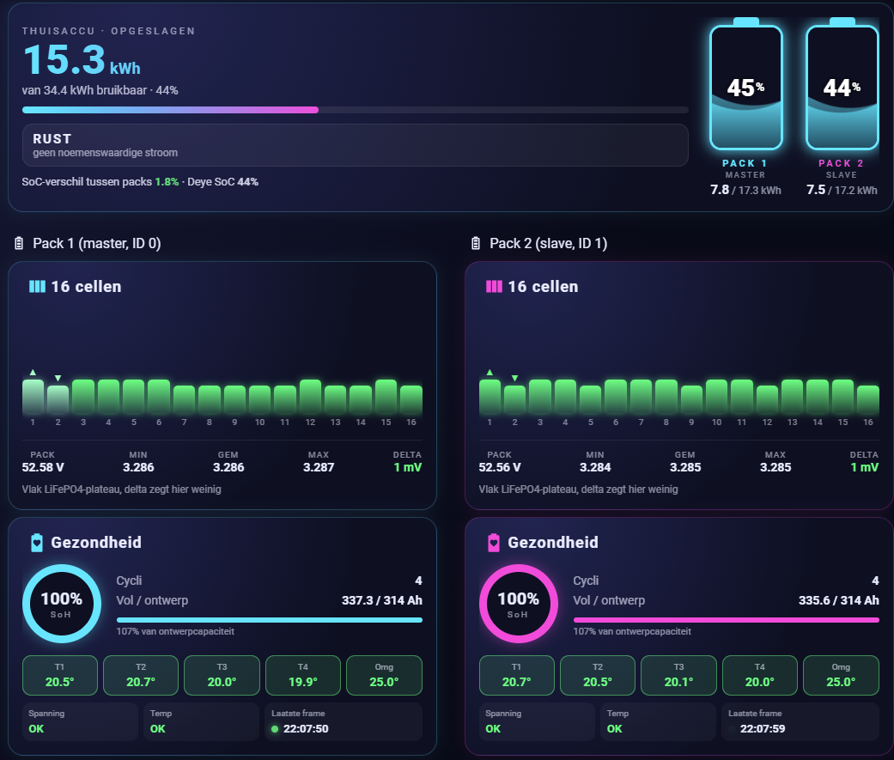
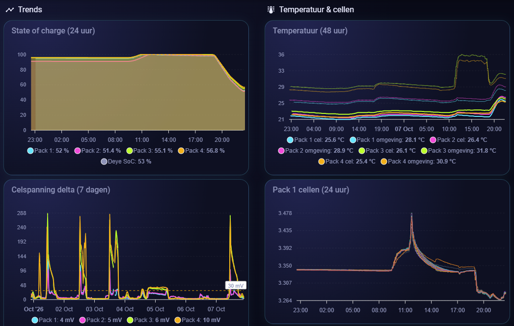
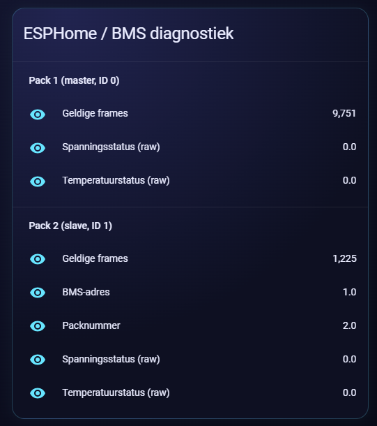
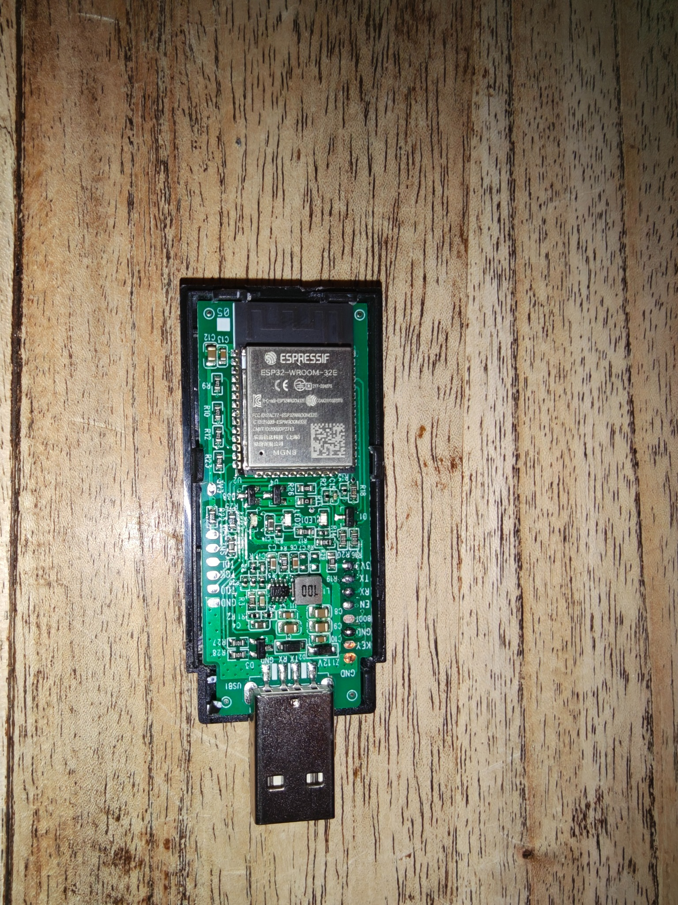
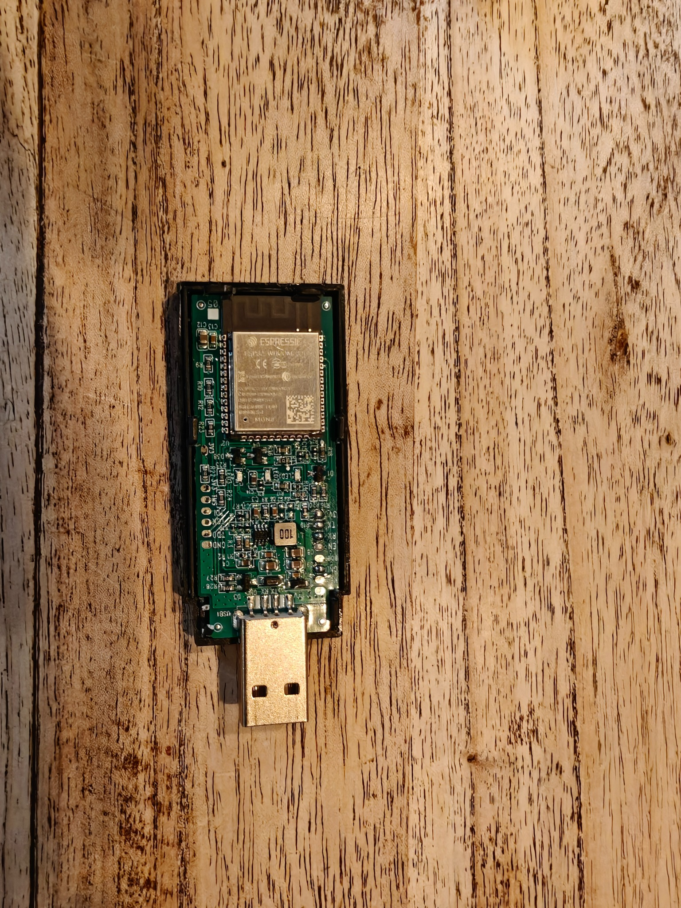
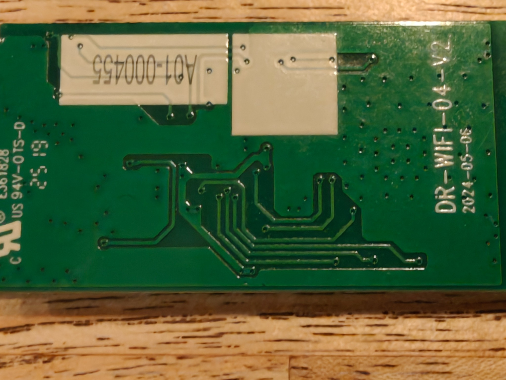
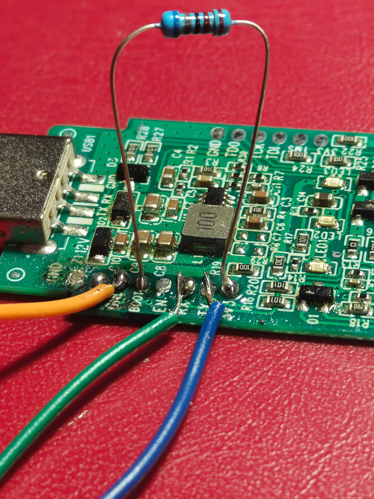

# Reverse-engineering the Docan DR-WIFI-04-V2 battery Wi-Fi stick for ESPHome

**Status:** working prototype, documented 27 September 2026  
**Board tested:** `DR-WIFI-04-V2`, PCB date `2025-05-16`  
**Module:** Espressif ESP32-WROOM-32E  
**Battery tested:** Docan/DoCan 16-cell LiFePO4 battery using the ASCII BMS protocol described below

## Home Assistant result

The decoded BMS data is published as native ESPHome entities. This dashboard combines both battery packs and shows state of charge, stored energy, individual cell voltages, cell delta, temperatures, capacity and state of health.



### Historical monitoring

Because the values are normal Home Assistant entities, they can be recorded and compared over time. This makes it possible to monitor pack synchronization, cell-voltage drift, temperature differences and balancing behaviour.



<details>
<summary>ESPHome and BMS diagnostics</summary>

The diagnostic entities expose valid-frame counters, raw status words and the automatically discovered BMS address and pack number.



</details>


## Summary

I replaced the original firmware on a Docan battery Wi-Fi stick with ESPHome. The stick now reads the BMS locally, publishes the values directly to Home Assistant, discovers the connected BMS address automatically, and uses its three onboard LEDs for useful local status.

The configuration currently provides:

- pack voltage, current, power, state of charge and state of health;
- remaining and full-charge capacity, cycle count and internal resistance;
- all 16 cell voltages plus minimum, maximum, average and delta;
- environment, pack, MOS and four cell temperatures;
- operating state: charging, discharging or idle;
- raw BMS alarm/status words for future decoding;
- design capacity and lifetime charge/discharge counters;
- valid/invalid frame counters and BMS communication state;
- automatic BMS-address discovery and recovery after a communication timeout;
- three automatic status LEDs.

The [generic ESPHome YAML](docan-wifi-stick-esphome.yaml) contains the complete implementation. It does not require a custom ESPHome component.

This is an independent reverse-engineering result, not official Docan documentation. Confirm the PCB revision and pinout before using it on another stick.

## Why this was needed

The stick already contains a capable ESP32, but its original application is cloud-oriented. The goal was to reuse the existing hardware for fully local monitoring in Home Assistant and to avoid adding a second microcontroller or an external UART adapter permanently.

The work had two parts:

1. determine the electrical connections of the ESP32, BMS UART, programming pads and LEDs;
2. capture and decode enough of the BMS protocol to build a robust ESPHome configuration.

## Board identification and orientation

The rear silkscreen identifies the tested board as:

- `DR-WIFI-04-V2`
- `2025-05-16`

For all LED descriptions below, the board is oriented with the **ESP32 module on the left** and the **USB-A plug on the right**. The LEDs then form a vertical row:

1. LED1 at the top;
2. LED2 in the middle;
3. LED3 at the bottom.

This ordering matches the PCB silkscreen.

### Board photographs



*Front of the opened stick: ESP32-WROOM-32E and labelled test pads.*



*Second front overview showing the component layout and USB-A plug.*



*Rear of the PCB with the `DR-WIFI-04-V2` marking, board date and visible traces.*



*Temporary bench setup with a soldered 10 kΩ resistor and test leads. I used 10 kΩ because I did not have the initially suggested 20 kΩ resistor; 10 kΩ worked for the test. After cleaning the pads, the stick worked again without the resistor. This is a troubleshooting photograph, not a required permanent modification.*

## Confirmed ESP32 connections

The most important result is that the programming UART and the BMS UART are separate.

| Function | ESP32 GPIO | Status |
|---|---:|---|
| BMS UART TX | GPIO4 | Confirmed and working |
| BMS UART RX | GPIO17 | Confirmed and working |
| Programming/debug UART TX (`U0TXD`) | GPIO1 | Confirmed at the board TX pad |
| Programming/debug UART RX (`U0RXD`) | GPIO3 | Confirmed at the board RX pad |
| LED1 cathode via R9 | GPIO25 | Confirmed and working |
| LED2 cathode via R10 | GPIO26 | Confirmed and working |
| LED3 cathode via R12 | GPIO27 | Confirmed and working |

The BMS connection works at **9600 baud, 8 data bits, no parity, 1 stop bit (8N1)**.

The ESP32-WROOM-32E datasheet maps module pins 10, 11 and 12 to GPIO25, GPIO26 and GPIO27 respectively. That was important because early measurements mixed up physical module pin numbers and GPIO numbers.

## Programming pads

The board exposes pads labelled approximately as follows:

- `GND`, `KEY`, `GND`, `BOOT`, `EN`, `RX`, `TX`, `3V3` on one side;
- `GND`, `TDO`, `TCK`, `TDI`, `TMS`, `3V3` and related test pads on the other side.

The conventional ESP32 serial-flashing connections are therefore available:

| USB-to-UART adapter | Stick |
|---|---|
| TX | RX / GPIO3 |
| RX | TX / GPIO1 |
| GND | GND |
| 3.3 V logic | 3V3 only if the board is not powered elsewhere |

Pull `BOOT` low while resetting with `EN` to enter the ROM download mode. Use a **3.3 V UART**, not 5 V logic. Do not connect two power sources to the board at the same time; if the stick is powered separately, connect only UART TX, RX and common ground.

The USB-A form factor should not by itself be treated as proof that every signal on the board is standard USB data. I only characterized the UART and power-related behavior needed for this project.

## How the LED pinout was found

The initial GPIO guesses did not control the LEDs. The successful process was:

1. With the stick powered, the USB-side terminal of all three LEDs measured 3.3 V.
2. Continuity testing showed that these three terminals share the board's 3.3 V rail.
3. In diode-test mode, placing the red probe on the USB side and the black probe on the other LED terminal illuminated each LED. The forward voltage was approximately 2.3–2.4 V.
4. The cathode traces were then followed through their series resistors to the ESP32 module pins.
5. Temporary ESPHome GPIO outputs confirmed the final mapping electrically and visually.

The final circuit is:

| LED | Series resistor | Resistor marking | ESP32 module pin | GPIO | Logic |
|---|---|---:|---:|---:|---|
| LED1, top | R9 | `472` (4.7 kΩ) | 10 | GPIO25 | Active-low |
| LED2, middle | R10 | `472` (4.7 kΩ) | 11 | GPIO26 | Active-low |
| LED3, bottom | R12 | `472` (4.7 kΩ) | 12 | GPIO27 | Active-low |

All three anodes are tied to 3.3 V. The ESP32 therefore sinks current: **GPIO low turns the LED on; GPIO high turns it off**. In ESPHome this is represented with `inverted: true`.

Earlier candidates such as GPIO32, GPIO33 and GPIO39 were ruled out. GPIO39 is input-only and cannot directly drive an LED. The apparent continuity readings that led to those candidates were high, rising resistance readings through other components rather than a direct copper connection.

## Final status-LED behavior

The test switches used during reverse engineering were removed from the final configuration. The LEDs are now internal outputs with automatic meanings:

| LED | Meaning | Behavior |
|---|---|---|
| LED1 / GPIO25 | ESPHome heartbeat | 120 ms flash every 2 seconds |
| LED2 / GPIO26 | Home Assistant connected | Solid while an API client subscribed to entity states is connected |
| LED3 / GPIO27 | Healthy BMS communication and activity | Solid while communication is healthy, with a 120 ms dark pulse for every valid BMS frame |

For LED2 the configuration uses ESPHome's `api.connected` condition with `state_subscription_only: true`. This deliberately ignores a logger-only client and makes the light a better approximation of an actual Home Assistant connection.

LED3 is switched off if no valid BMS frame has been received for more than 30 seconds. The timeout check runs every 10 seconds, so the visual change can occur up to almost 10 seconds after the 30-second threshold.

## GPIO1, GPIO3 and D1

GPIO1 and GPIO3 are not spare LED outputs. They are the ESP32's default UART0 pins:

- GPIO1 = `U0TXD` and is connected to the board's TX pad;
- GPIO3 = `U0RXD` and is connected to the board's RX pad.

UART0 is used by the ESP32 ROM for downloading firmware and by normal firmware for serial logging. The ESPHome configuration uses `logger: baud_rate: 0`, which disables runtime UART logging, but the pins should still be left alone because they remain important for flashing and may carry ROM boot messages during reset.

D1 is a three-terminal device connected to both GPIO1 and GPIO3. Diode-mode measurements with the red probe on its common terminal gave approximately 0.573 V and 0.700 V toward the two branches. Low-resistance checks associated those branches with GPIO1 and GPIO3.

What is **not yet proven** is where the common D1 terminal ultimately goes. Plausible roles include input protection/clamping or diode-OR activity coupling. It is not the primary LED1 driver: LED1 is conclusively controlled through R9 by GPIO25.

Two useful follow-up measurements would be:

- D1 common terminal to ground;
- D1 common terminal to the LED1 cathode.

## JTAG and other test pads

Two test-pad paths were followed physically:

| Test pad | Resistor | Confirmed GPIO |
|---|---|---:|
| TCK | R25, marked `1001` (1 kΩ) | GPIO13 |
| TDO | R26, marked `1001` (1 kΩ) | GPIO15 |

This matches the ESP32's default JTAG assignment:

| JTAG signal | Default ESP32 GPIO |
|---|---:|
| TDI / MTDI | GPIO12 |
| TCK / MTCK | GPIO13 |
| TMS / MTMS | GPIO14 |
| TDO / MTDO | GPIO15 |

Only the TCK and TDO resistor paths were explicitly continuity-confirmed on this board. TDI and TMS are consistent with the standard ESP32 mapping but still need direct board-level confirmation.

Measurements between the LED cathodes and these JTAG pads were in the megaohm range and rising. They are not the LED control paths.

## GPIO2, D4 and D38

D4 and D38 are nearby three-terminal parts. One shared terminal was found on the 3.3 V rail, and another node appears to be reached from GPIO2 through a resistor. However, measurements from LED2 and LED3 to these devices were in the megaohm range and rose while measuring. They are therefore not direct LED drivers.

Their exact purpose remains unresolved; they may be part of power, supervision or another support circuit. GPIO2 is also an ESP32 strapping pin, so the safe choice is to leave it unused until this circuit is understood.

## BMS serial protocol

The BMS uses printable ASCII hexadecimal frames. Every captured frame starts with `~` and ends with carriage return (`\r`). A frame can be described as:

| Full-frame character position | Size | Meaning |
|---:|---:|---|
| 0 | 1 | Start marker `~` |
| 1 | 2 | Protocol/version field, observed `22` |
| 3 | 2 | BMS address |
| 5 | 2 | Function family, observed `4A` |
| 7 | 2 | Command in requests or return code in responses |
| 9 | 4 | Length word |
| 13 | variable | Payload as ASCII hex |
| final 4 | 4 | ASCII checksum |

The lower 12 bits of the four-character length word are the **number of ASCII payload characters**, not the number of decoded bytes. The count must therefore be even.

### Checksum

The checksum is the 16-bit two's complement of the sum of every ASCII byte after `~`, up to but not including the checksum itself:

```text
sum = ASCII(frame[1 ... character_before_checksum])
checksum = (-sum) & 0xFFFF
```

The checksum is appended as four uppercase hexadecimal characters.

### Confirmed requests

| Purpose | Request or addressed command tail | Schedule used |
|---|---|---:|
| Discover BMS address | `~22004A500000FDA2\r` | Every 5 s until discovered |
| Live telemetry | `42E00200` | Every 10 s |
| Lifetime counters, group 04 | `B0600A000104FF00` | Every 60 s |
| Manufacturer data | `510000` | Manual diagnostic button only |

Addressed frames are built at runtime. For example, with address `01` the live request is:

```text
~22014A42E00200FD29\r
```

One observed lifetime request and response at address `00` were:

```text
TX: ~22004AB0600A000104FF00FB6D\r
RX: ~22004A00D030B0000104FF12445783C07AA8000005440000048D02D80266F38E\r
```

The manufacturer-data command is included only as a diagnostic button. Its response fields have not yet been decoded.

## Automatic BMS-address discovery

Hard-coding the address worked during early tests but was not robust because different packs answered at addresses such as `00`, `01` and `02`.

The final logic does this:

1. initialize the address to `0xFF`, meaning unknown;
2. broadcast `~22004A500000FDA2\r` every 5 seconds;
3. accept a checksummed zero-length success response;
4. learn the address from characters 3–4 of that response;
5. show the corresponding pack number as address + 1;
6. send subsequent telemetry requests to the discovered address;
7. forget the address and restart discovery after a BMS timeout.

Address `0x00` is valid, which is why `0xFF` is used as the unknown sentinel.

Only the zero-length discovery response is used to learn the address. This prevents an ordinary response-header value from accidentally changing it.

## Decoded live telemetry payload

All multi-byte values below are big-endian. `be16(i)` means a 16-bit unsigned value starting at decoded payload byte `i`; signed temperature and current fields use a signed 16-bit interpretation.

### Fixed beginning

| Payload offset | Field | Scale |
|---:|---|---:|
| 1–2 | State of charge | `be16(1) / 100` % |
| 3–4 | Pack voltage | `be16(3) / 100` V |
| 5 | Cell count `N` | 1–16 |
| 6 onward | `N` cell voltages | each `be16 / 1000` V |

Let `p = 6 + 2N`, immediately after the cell voltages:

| Relative offset | Field | Scale |
|---:|---|---:|
| `p + 0` | Environment temperature | signed `be16 / 10` °C |
| `p + 2` | Pack average temperature | signed `be16 / 10` °C |
| `p + 4` | MOS temperature | signed `be16 / 10` °C |
| `p + 6` | Temperature-sensor count `T` | byte |
| `p + 7` onward | `T` individual temperatures | each signed `be16 / 10` °C |

Let `q = p + 7 + 2T`, immediately after the individual temperatures:

| Relative offset | Field | Scale |
|---:|---|---:|
| `q + 0` | Pack current | signed `be16 / 100` A |
| `q + 2` | Pack internal resistance | `be16 / 10` mΩ |
| `q + 4` | State of health | `be16` % |
| `q + 6` | User-defined number | one byte, currently skipped |
| `q + 7` | Full-charge capacity | `be16 / 100` Ah |
| `q + 9` | Remaining capacity | `be16 / 100` Ah |
| `q + 11` | Cycle count | `be16` |

Power is calculated locally as voltage × current. The operating state is derived as:

- charging above +0.10 A;
- discharging below −0.10 A;
- idle between those thresholds.

The final part of the live payload contains status fields. Voltage, current, temperature, alarm, FET, balance-low, balance-high, machine and I/O status are exposed as raw diagnostic entities. Their vendor-specific individual bits have not yet been confidently decoded.

## Decoded lifetime-counter payload

The lifetime response is recognized by:

```text
payload[0] = B0
payload[2] = 01
payload[3] = 04
payload[4] = FF
```

The confirmed fields are:

| Payload offset | Field | Scale |
|---:|---|---:|
| 10–11 | Design capacity | `be16 / 100` Ah |
| 12–15 | Lifetime charged capacity | `be32 / 10` Ah |
| 16–19 | Lifetime discharged capacity | `be32 / 10` Ah |
| 20–21 | Lifetime charged energy | `be16 / 100` kWh |
| 22–23 | Lifetime discharged energy | `be16 / 100` kWh |

The 0.1 Ah scale of the 32-bit lifetime-capacity counters was checked against the corresponding energy counters and the values displayed by the system.

## Example validated values

The following values were decoded from real captured frames and were internally consistent:

| Measurement | Observed value |
|---|---:|
| Pack voltage | 52.64 V |
| Pack current | −0.70 to −0.82 A |
| Calculated power | −37 to −43 W |
| State of charge | about 51.87–51.89 % |
| State of health | 100 % |
| Remaining capacity | about 174.95–175.02 Ah |
| Full-charge capacity | 337.28 Ah |
| Cycle count | 4 |
| Cell count | 16 |
| Cell voltage range | 3.289–3.291 V |
| Cell delta | 1–2 mV |
| Environment temperature | 24.4 °C |
| Pack average temperature | 20.0 °C |
| MOS temperature | 21.8 °C |
| Four cell temperatures | 20.2, 20.4, 19.8, 19.7 °C |
| Design capacity | 314.00 Ah |
| Lifetime charged capacity | 134.80 Ah |
| Lifetime discharged capacity | 116.50 Ah |
| Lifetime charged energy | 7.28 kWh |
| Lifetime discharged energy | 6.14 kWh |

These values also provided useful checks for signed current, decimal scaling and dynamic payload offsets.

## ESPHome implementation details

The generic configuration uses ESP-IDF and declares an 8 MB flash size, matching the configuration tested on this hardware. Its main behaviors are:

- UART debug captures complete frames ending in carriage return;
- every response is checked for framing, hexadecimal validity, declared length and checksum before use;
- malformed frames increment an invalid-frame counter;
- valid frames increment a valid-frame counter and refresh BMS communication state;
- live telemetry is requested every 10 seconds;
- lifetime counters are requested every 60 seconds;
- BMS communication becomes false after more than 30 seconds without a valid frame;
- cell entities are throttled to 30 seconds to reduce Home Assistant recorder traffic;
- aggregate pack values update on each live response;
- API encryption, OTA, fallback AP and captive portal remain available.

The UART parser uses an inline ESPHome lambda. No cloud connection and no external custom component are required.

Copy the [generic ESPHome YAML](docan-wifi-stick-esphome.yaml) into your ESPHome configuration, set a unique `esphome.name` and `friendly_name`, and define these values in your local `secrets.yaml`:

```yaml
wifi_ssid: "your-ssid"
wifi_password: "your-wifi-password"
docan_api_encryption_key: "your-generated-api-key"
docan_ap_password: "your-fallback-ap-password"
```

Change `esphome.name` and `friendly_name` for each stick. Do not give two sticks the same ESPHome name.

## What is confirmed and what remains open

### Confirmed

- PCB identity and ESP32 module family;
- BMS UART on GPIO4/GPIO17 at 9600 8N1;
- serial programming UART on GPIO1/GPIO3;
- LED1/2/3 on GPIO25/GPIO26/GPIO27 through R9/R10/R12;
- common 3.3 V LED anodes and active-low drive;
- working checksum and length validation;
- BMS-address discovery;
- live telemetry and lifetime-counter decoding;
- automatic status-LED operation in ESPHome;
- TCK through R25 to GPIO13 and TDO through R26 to GPIO15.

### Still open

- exact purpose and common-node destination of D1;
- exact purpose of D4/D38 and the surrounding GPIO2 circuit;
- direct continuity confirmation of the TDI and TMS pads;
- meanings of the individual raw status bits;
- manufacturer-data response structure;
- whether other Docan PCB revisions have the same pinout and protocol layout.

No BMS setting-changing or control commands were investigated. This work intentionally focuses on read-only monitoring.

## Safety and reproducibility notes

- Disconnect the stick from the battery/inverter while soldering or continuity-testing.
- Never use resistance or diode mode on a powered board.
- Use 3.3 V UART logic.
- Confirm ground and supply rails before connecting a flasher.
- Avoid driving ESP32 strapping pins such as GPIO2, GPIO12 and GPIO15 during boot.
- Preserve a copy of the original firmware if you have a reliable way to read it before erasing.
- Expect other PCB revisions to differ; verify traces instead of relying only on the board's physical resemblance.
- Test the configuration on the bench before depending on it for alarms or protection. The BMS itself, not ESPHome or Home Assistant, must remain responsible for battery protection.

## Useful follow-up work for the community

Contributions that would help complete this reverse engineering include:

- clear photographs of other board revisions;
- continuity measurements for D1, D4, D38, TDI and TMS;
- raw frames captured while specific alarms or balancing states are deliberately active;
- manufacturer documentation for the DR-1363 data groups;
- confirmation of the YAML on Noon, YP, LN, Panda or other Docan pack families;
- a safe decoding table for the raw voltage/current/temperature/alarm/FET/I/O status bits.

Additional leads from an independent analysis of the original `wifi_32` firmware (not yet verified against captured responses from this pack):

- Check the high nibble of the four-character LENGTH word. It appears to be `(-sum of the three LENID nibbles) & 0x0F`. The current ESPHome parser checks the 12-bit payload length and frame checksum, but not this length checksum.
- Capture a response to read-only command `0x84` and compare it with the working `0x42` live-telemetry response and simultaneous app values. The original firmware reportedly polls `0x84`, with a different, apparently fixed response layout. Do not assume the two responses are interchangeable.
- Before experimenting with another long response, make the ESPHome parser distinguish response types explicitly. At present, an unrelated valid frame could otherwise be interpreted as `0x42` telemetry if its length and a few payload positions happen to match.
- Investigate read-only commands `0x80`, `0x83` and `0x4D` separately, and compare their responses with the still-unknown status fields and BMS clock. Treat firmware-derived field names and scales as hypotheses until checked against captured frames.
- Compare the original firmware's reported `0x50`, `0x51`, `0xA0`, `0xB0` and `0xB1` poll cycle with actual UART captures; record BMS model, firmware version and address for each capture.
- Map the original firmware's two update paths without running an update. The active image contains distinct `BMS_OTA` and `sys_OTA` code and a shared-looking `download_upgrade_file`/`/drgk/web/binFile/` path. The BMS path includes `bms_bin_V%d.%d.%d.bin`, update-state persistence, and log messages `send reset cmd`, `send file info` (file size and packet count), and `send data %d`, plus timeout/read/write error handling. The stick path uses ESP-IDF's `esp_ota_write`, selects the next boot partition and restarts. Determine from disassembly or a passive capture how the update type selects a file and destination, whether the versioned BMS filename is remote or only local, and the exact BMS UART packet format, acknowledgements, integrity checks and recovery behavior. These strings establish the broad workflow, not a verified update procedure.\n- Investigate the factory-looking Wi-Fi configuration found in one original firmware dump's NVS partition (SSID `DR_New_Energy`, with a preconfigured password). Determine whether the stick joins that network as a client or creates its own access point, and whether the entry is only a leftover production/test setting. This single dump does not prove every unit ships with the same credentials, establish the Wi-Fi mode, or show that a user's network was never configured. If a working credential is shared across production devices, the manufacturer should address it.

The original firmware also appears to support remote settings and BMS firmware updates. Those write paths are outside the scope of this read-only project. Do not publish a raw flash dump: its NVS partition may contain Wi-Fi credentials or other device-specific data.

When sharing captures, remove Wi-Fi credentials, API keys, MAC addresses and any serial numbers you consider private.

## References

- [Espressif ESP32-WROOM-32E / ESP32-WROOM-32UE datasheet](https://www.espressif.com/sites/default/files/documentation/esp32-wroom-32e_esp32-wroom-32ue_datasheet_en.pdf)
- [Espressif ESP32 schematic checklist: UART0 download and logging pins](https://docs.espressif.com/projects/esp-hardware-design-guidelines/en/latest/esp32/schematic-checklist.html)
- [Espressif: configuring other JTAG pins](https://docs.espressif.com/projects/esp-idf/en/stable/esp32/api-guides/jtag-debugging/configure-other-jtag.html)
- [ESPHome logger component](https://esphome.io/components/logger/)
- [ESPHome native API component](https://esphome.io/components/api/)
